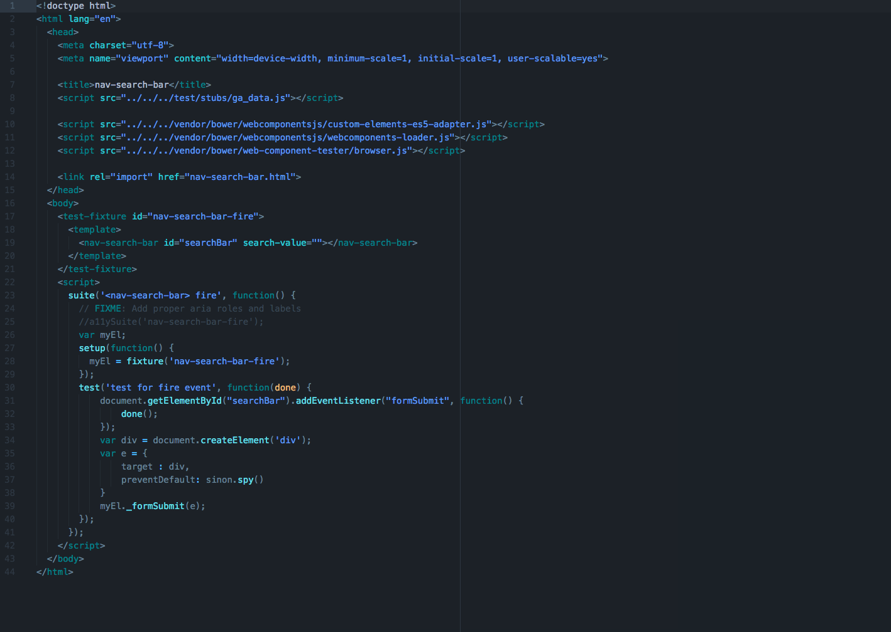
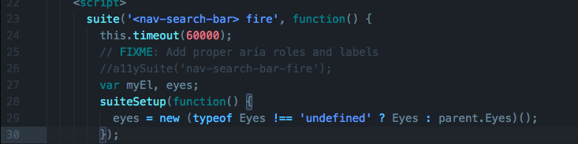
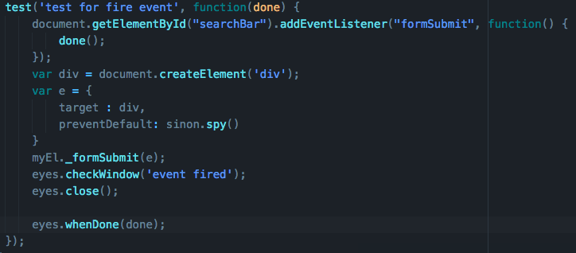

# Polymer Storybook SDK Documentation

Polymer Storybook is a tool that allows users to detects component bugs far upstream in the development process, when you first code your components. This prevents bugs from appearing downstream in applications, when they’re harder to diagnose.  Previously, Storybook was only available for React, Due and Angular, but Applitools has listened to customer feedback and created a version for the popular Polymer library  I will take you through a step-by-step guide on how to use this set up, install, and begin using this innovative testing tool within the Universal Web Client.

Pre-requisuites:

* Applitools account:  If you do not have one set up, follow the steps for here.
* Node.js
* Polymer CLI
* NPM
* Bower

## Installing Universal Web Client Repository

First, you will need to clone the repo by running the following command in the terminal.  Be sure that you are located in the place you want the repository to be cloned.

`git clone https://github.com/GannettDigital/universal-web-client.git`

Afterwards, change into the project's directory

`cd universal-web-client`

## Install the Project and JavaScript Dependencies

Run the following command(s) to complete your set up:

`npm install && npm run install-local-globals && npm run install-third-parties`

Bob's your uncle!

**note:** Please make sure that you are using Java Version 8 and not Java Version 11.  Version 11 has been known to cause issues with Selenium and Polymer Storybook

## Install wct-eyes

Install wct-eyes as dependencies using one of the following options.

`npm install wct-eyes --save-dev`

OR 

`npm install -g wct-eyes`

## Enable wct-eyes

Now that that's done, go ahead and locate the wct.conf.json file.  Open it, navigate to the plugins property and insert the following object:

`"eyes": {
	"disabled": false,
	"serverURL": "https://gannetteyes.applitools.com/"
}`

## Refactoring Web Component Tests

Implementing Polymer Storybook support for pre-existing tests is a simple process, and should take you no longer than ten minutes on your first attempt.  I will be refactoring a test to implement support below.

We will be using nav_search_bar.test.html test as an example.  Open the file in your text editor, it is located here: 

elements -> nav -> nav-search-bar -> nav-search-bar.test.html



Below `suite`, add the following:
```
suite('<nav-search-bar> fire', function() {
    this.timeout(60000);
```
 We need a timeout in order for visual validation to execute properly.  Next, we need to initialize the `eyes` class. `eyes` allows you to programmatically define and run your visual UI tests. The class provides many functions that execute different functions like running checkpoints, test execution, tearing down the eyes class, and more.  You can find a full list [here](https://applitools.com/docs/api/eyes-sdk/index-gen/class-eyes-selenium-java.html).  `eyes` will be initialized next to `myEl`.

 `var myEl, eyes;`

 Before our `setup()` function and below our initialized variables, we need to include a `suiteSetup` function to define our `eyes` class.  It will look like this:

```
suiteSetup(function() {
    eyes = new (typeof Eyes !== 'undefined' ? Eyes : parent.Eyes)(); 
});
```

So this is what we have so far:



Next, inside our `setup` function, we will be adding a special `return` statement.  Note that you should use suite name as application name and test name as test name

`return eyes.open(this.test.parent.title, this.currentTest.title);`

And now we move on to the test itself.  In order to get our visual results that we need, we will be utilizing the `checkWindow()` method, which you can read more about [here](https://applitools.com/docs/api/eyes-sdk/classes-gen/class_eyes/method-eyes-checkwindow-selenium-java.html).



Lastly, we need to include the `tearDown()` function to close our session with `eyes`.

```
teardown(function () {
       return eyes.abortIfNotClosed(); // used to close session if an error occurred in a test
     });
```

I hope this assists you with uding Polymer Storybook!  For more information, check out the following links:

* [wct-eyes Repository](https://github.com/applitools/wct-eyes)
* [Eyes Class Documentation](https://applitools.com/docs/api/eyes-sdk/index-gen/class-eyes-selenium-java.html)
* [wct-eyes Example Repository](https://github.com/applitools/wct-eyes-example)